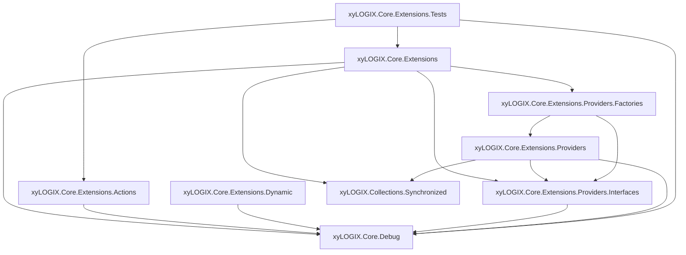

# xyLOGIX.Core.Extensions `module`

`xyLOGIX.Core.Extensions` is a proprietary .NET Framework 4.8 / C# 7.3 module that extends the .NET Base Class Library and Windows Forms with defensive, heavily documented utility methods, fluent action classes, dynamic helpers, provider infrastructure, and NUnit test coverage.

This repository is part of the xyLOGIX family of class-library modules. It is intentionally conservative: legacy MSBuild projects, `packages.config`, PostSharp, log4net, AlphaFS, and Vsxmd are preserved so downstream xyLOGIX applications and Visual Studio extension code can continue to consume the libraries without churn.

## Important notice

This codebase is proprietary software. It is not MIT licensed.

Do not add MIT license text, MIT license references, or mandatory MIT-style source-file headers to this repository. Preserve existing file headers or above-namespace documentation if present, but do not introduce a new mandatory header standard.

## Target stack

| Area | Technology |
|---|---|
| Language | C# 7.3 |
| Runtime | .NET Framework 4.8 |
| IDE | Visual Studio 2022 / 2026-compatible solution files |
| Project format | Legacy MSBuild `.csproj` |
| NuGet style | `packages.config` |
| Logging | `xyLOGIX.Core.Debug`, log4net 3.0.3, PostSharp Diagnostics |
| AOP / threading | PostSharp 2024.1.6 |
| File system | AlphaFS 2.2.6 where already used |
| JSON | Newtonsoft.Json 13.0.3 where already used |
| Documentation | Vsxmd 1.4.5 |
| Tests | NUnit 4.3.2 |
| Strong naming support | StrongNamer 0.2.5 where present |

Do not convert these projects to SDK-style format, migrate to `PackageReference`, introduce nullable reference types, or use C# language features newer than C# 7.3 unless explicitly requested.

## Table of contents

1. [Solution overview](#solution-overview)
2. [Repository shape](#repository-shape)
3. [Architecture and dependency direction](#architecture-and-dependency-direction)
4. [Project guide](#project-guide)
5. [API area guide](#api-area-guide)
6. [Cross-cutting design conventions](#cross-cutting-design-conventions)
7. [Build, packages, and generated documentation](#build-packages-and-generated-documentation)
8. [Running tests](#running-tests)
9. [Using the libraries](#using-the-libraries)
10. [Contributor workflow](#contributor-workflow)
11. [Detailed API reference](#detailed-api-reference)
12. [Documentation links](#documentation-links)

## Solution overview

The `xyLOGIX.Core.Extensions` solution is a cohesive group of .NET Framework class libraries whose collective purpose is to augment the Base Class Library and Windows Forms with focused, defensive extension methods, action classes, and provider infrastructure.

The module emphasizes:

- Backward compatibility for public API consumers.
- Defensive validation before work is attempted.
- Safe default return values instead of avoidable exception propagation.
- Explicit logging through `xyLOGIX.Core.Debug.DebugUtils`.
- PostSharp logging, synchronization, and `[NotLogged]` usage.
- XML documentation that can be converted into Markdown documentation by Vsxmd.
- Clean dependency direction with no circular project references.
- Small, focused helpers rather than broad framework rewrites.

Most nontrivial non-`void` methods follow the local `result` variable pattern: initialize a safe default, validate eagerly, perform work inside a `try` block, log exceptions in `catch`, reset to a safe default if needed, and return `result`.

## Repository shape

The solution file is:

- `xyLOGIX.Core.Extensions.sln`

The module contains these projects:

| Project | Responsibility |
|---|---|
| `xyLOGIX.Core.Extensions` | Primary extension-method library plus WinForms interfaces, helper types, validators, and utility classes. |
| `xyLOGIX.Core.Extensions.Actions` | Fluent static action classes such as `Prefer` and `Round`. |
| `xyLOGIX.Core.Extensions.Dynamic` | Dynamic-value helpers such as `DynamicPrefer`, isolated from the main library. |
| `xyLOGIX.Core.Extensions.Providers.Interfaces` | Provider contracts, currently including `IControlFormAssociationProvider`. |
| `xyLOGIX.Core.Extensions.Providers` | Provider implementations, currently including `ControlFormAssociationProvider`. |
| `xyLOGIX.Core.Extensions.Providers.Factories` | Factory accessors such as `GetControlFormAssociationProvider.SoleInstance()`. |
| `xyLOGIX.Core.Extensions.Tests` | NUnit tests for extension and action behavior. |

The solution also references external sibling repositories/projects, including:

- `xyLOGIX.Core.Debug`
- `xyLOGIX.Collections.Synchronized`

Do not assume those sibling repositories can be edited as part of this repository unless the prompt explicitly provides them or requests cross-repository work.

## Architecture and dependency direction

Maintain the existing acyclic dependency direction:



Key rules:

| Rule | Detail |
|---|---|
| Avoid cycles | Before adding a project reference, verify the direct and transitive reference graph. |
| Keep provider contracts low-level | `Providers.Interfaces` defines contracts and must not depend on implementation projects. |
| Keep dynamic usage isolated | `xyLOGIX.Core.Extensions.Dynamic` contains dynamic-specific helpers so the main library does not accumulate avoidable DLR usage. |
| Keep actions independent | `xyLOGIX.Core.Extensions.Actions` does not depend on the main `Extensions` project. |
| Use factories for provider access | Consumers should use factory accessors rather than directly constructing provider implementations. |

## Project guide

### `xyLOGIX.Core.Extensions`

This is the primary library. It contains:

- Static `*Extensions` classes for BCL, collection, path, markdown, enum, type, string, numeric, and WinForms types.
- WinForms interfaces such as `IForm`, `IControl`, `IUserControl`, `IScrollableControl`, `IComboBox`, `IListView`, and `ITextBox`.
- Helper types such as `BoundComboBox` and `EnumBoundComboBoxItem`.
- Enums and validators such as `LanguageArticleType`, `LanguageArticleTypeValidator`, and `ReplaceAnyOfOption`.
- Static helper/action-style classes such as `Calculate` and `Transform`.

When adding extension methods, place them in the extension class that matches the extended type. If no suitable class exists, create a public static `<Type>Extensions` class in the `xyLOGIX.Core.Extensions` namespace.

### `xyLOGIX.Core.Extensions.Actions`

This project contains static action classes that are named as verbs and read fluently at call sites.

| Class | Purpose |
|---|---|
| `Prefer` | Merges nullable or optional input values with preferred fallback values. |
| `Round` | Performs rounding operations such as rounding decimal values to the nearest cent. |

The project intentionally stays independent from the main `Extensions` project.

### `xyLOGIX.Core.Extensions.Dynamic`

This project contains dynamic-value helpers such as `DynamicPrefer`.

`dynamic` is isolated here so the main extension library does not acquire avoidable DLR-related behavior. Add dynamic-specific behavior here rather than to `xyLOGIX.Core.Extensions` unless the owner explicitly requests otherwise.

### Provider projects

The provider trio maintains clean dependency direction around control-to-form association behavior.

| Project | Role |
|---|---|
| `xyLOGIX.Core.Extensions.Providers.Interfaces` | Defines provider contracts such as `IControlFormAssociationProvider`. |
| `xyLOGIX.Core.Extensions.Providers` | Implements provider contracts, including singleton-style provider implementations. |
| `xyLOGIX.Core.Extensions.Providers.Factories` | Exposes fluent factory accessors such as `GetControlFormAssociationProvider.SoleInstance()`. |

`ControlFormAssociationProvider` maintains a synchronized mapping between WinForms controls and parent forms, and removes associations as controls and forms are disposed or closed.

### `xyLOGIX.Core.Extensions.Tests`

This project contains NUnit tests for selected library behavior. Existing tests cover areas such as `Prefer` and `NumberExtensions`.

Add tests here when requested or when a change is risky enough to warrant coverage. Prefer focused fixtures corresponding to the concrete class or extension class under test.

## API area guide

### Core extension classes

The main project contains extension classes including, but not limited to:

| Area | Representative class(es) | Purpose |
|---|---|---|
| Strings | `StringExtensions`, `StringArrayExtensions`, `MarkdownExtensions` | Case conversion, matching, replacement, Markdown formatting, pluralization, and text helpers. |
| Collections | `EnumerableExtensions`, `CollectionExtensions`, `ListExtensions`, `SetExtensions`, `DictionaryExtensions` | Null-safe enumeration, additions, lookups, snapshots, and collection helpers. |
| Numbers | `NumberExtensions`, `IntExtensions`, `LongExtensions`, nullable numeric extensions | Sign checks, zero checks, range checks, nullable numeric guards, and conversions. |
| Dates | `DateTimeExtensions`, `DateTimeOffsetExtensions` | RFC 3339 formatting and sentence-fragment formatting. |
| GUIDs | `GuidExtensions` | GUID formatting and Zero GUID detection. |
| Enums | `EnumExtensions`, validators | Description lookup and range validation. |
| Bytes | `ByteArrayExtensions` | Safe length, hex, and Base64 formatting. |
| Types | `TypeExtensions` | Reflection helpers and cached actual-type resolution. |
| Paths | `PathnameExtensions` | AlphaFS-backed path helpers. |
| WinForms | `ControlExtensions`, `FormExtensions`, `TextBoxExtensions`, `ComboBoxExtensions`, `CheckedListBoxExtensions`, `ToolStripMenuItemExtensions`, `BindingManagerBaseExtensions`, `ComponentExtensions` | UI-thread, lifetime, geometry, cue-banner, binding, and control helpers. |

### Fluent action classes

`xyLOGIX.Core.Extensions.Actions` contains verb-named utility classes whose method names complete the phrase at the call site.

Examples:

```csharp
var port = Prefer.IntOverNull(userPort, configuredPort);
var amount = Round.ToNearestCent(rawAmount);
```

### Dynamic helpers

`xyLOGIX.Core.Extensions.Dynamic` contains `DynamicPrefer`, which provides prefer-over-null semantics for `dynamic` values without adding DLR-oriented behavior to the main extension library.

### Provider infrastructure

`ControlExtensions` uses the provider/factory trio to associate WinForms controls with parent forms while keeping dependency direction clean:

```csharp
using xyLOGIX.Core.Extensions;

control.AssociateWithParentForm();
var form = control.GetParentForm();
```

Consumers normally use the extension methods rather than calling the provider directly.

## Cross-cutting design conventions

### Defensive programming

Methods should validate input values before they are used. Do not assume:

- Strings are nonblank.
- Paths exist.
- Collections contain useful values.
- Enum values are defined.
- WinForms controls are alive, undisposed, or handle-created.
- Numeric values, counts, sizes, or indexes are positive or in range.
- File-system operations succeed.
- Called helper methods return useful values.

Prefer guard clauses and early returns. Avoid deep nesting. Keep validation gates explicit when separate checks improve logging and control-flow clarity.

### Result-variable pattern

Most value-returning methods use a `result` variable:

```csharp
public bool TryDoSomething(string value)
{
    var result = false;

    try
    {
        if (string.IsNullOrWhiteSpace(value)) return result;

        /* If we made it this far with no Exception(s) getting caught, then assume that the operation(s) succeeded. */
        result = true;
    }
    catch (Exception ex)
    {
        // dump all the exception info to the log
        DebugUtils.LogException(ex);

        result = false;
    }

    return result;
}
```

Match the surrounding method family when it uses a more specific variant of this pattern.

### Logging and PostSharp

The projects use `xyLOGIX.Core.Debug.DebugUtils`, log4net, and PostSharp Diagnostics.

Common conventions:

- Use `DebugUtils.LogException(ex);` in exception paths.
- Place `// dump all the exception info to the log` immediately before exception logging.
- Use `*** SUCCESS ***`, `*** WARNING ***`, and `*** ERROR ***` consistently where surrounding code does so.
- Log final `Result = {result}` values where the surrounding method family does so.
- Avoid `GetType().Name` in log messages when the literal type name is known.
- Use `[Log(AttributeExclude = true)]` for static constructors and other members that should be excluded from automatic PostSharp logging.
- Do not apply `[Log(AttributeExclude = true)]` to enums or enum members.
- Do not regenerate `GlobalAspects.cs` unless explicitly requested.

### `[NotLogged]` usage

Use `[NotLogged]` on method parameters that should not be captured by PostSharp logging, including complex reference types, `object`, delegates, WinForms controls and forms, collections, and structured value types such as `Guid` or `Rectangle`.

Use `[return: NotLogged]` on methods returning non-primitive or sensitive values.

Do not add `[return: NotLogged]` to properties solely because the property type is complex. The projects' `GlobalAspects.cs` files already exclude property getters and setters from logging.

### XML documentation

XML documentation matters because Vsxmd turns it into project README files.

General expectations:

- Document public, internal, protected, and private code entities when generating or revising code.
- Preserve existing documentation unless behavior changes.
- Use fully qualified `<see cref="..." />` references when doing so is valid and does not create an inappropriate project reference or circular dependency.
- Use `<c>...</c>` for file names, attributes, code constructs, and conceptual type mentions that should not be cross-reference targets.
- Use `<see langword="null" />`, `<see langword="true" />`, and `<see langword="false" />` for C# keywords when referring to keyword values.
- Start new `<param>` tag contents with `(Required.)` or `(Optional.)`.
- Use `<paramref name="..." />` when referring to parameters.
- Use `<para />` between adjacent documentation sentences when multiline remarks are needed.
- Use accurate value-type and reference-type wording.

### Collections, LINQ, and thread safety

Avoid materializing collections unless it is necessary for correctness, performance, or thread safety.

Do not iterate an `IEnumerable<T>` more than once needlessly. When a thread-safe snapshot is required, materialize with `ToArray()` and iterate the snapshot unless the source is already a known concurrent or synchronized collection.

Avoid LINQ extension methods in hot, multithreaded, or parallel-processing paths when an explicit loop provides safer control. LINQ is acceptable in ordinary non-thread-sensitive code when it improves clarity and matches the surrounding implementation.

### General code style

- Use C# 7.3-compatible syntax only.
- Prefer `var`, `out var`, and compatible pattern matching where it matches surrounding code.
- Place fields and constants before properties that depend on them.
- Use auto-properties where possible.
- Decorate property getters and setters with `[DebuggerStepThrough]` when surrounding code does so.
- Do not use `#region` or `#endregion`.
- Avoid `++` and `--`; prefer `Interlocked.Increment` and `Interlocked.Decrement` when mutation must be atomic or thread-aware.
- Delete dead code when a refactor makes it obsolete, unless asked to preserve it.
- Do not regenerate `AssemblyInfo.cs` unless explicitly requested.

## Build, packages, and generated documentation

This repository intentionally uses legacy project conventions.

When changing dependencies:

- Do not migrate to `PackageReference` unless explicitly requested.
- Do not update package versions as incidental cleanup.
- Keep `allowedVersions` ranges aligned with pinned package versions where already present.
- Keep `PostSharp.props`, `PostSharp.targets`, `NUnit.props`, and `Vsxmd.targets` imports intact.
- Do not add project references unless there is a clear requirement and no circular dependency risk.

The projects import Vsxmd targets and contain generated `README.md` files. When changing public XML documentation, ensure generated Markdown remains useful and conceptually aligned.

## Running tests

Tests are located in `xyLOGIX.Core.Extensions.Tests`.

For .NET Framework 4.8 projects, Visual Studio Test Explorer or `vstest.console.exe` is usually the most reliable runner.

```shell
vstest.console.exe xyLOGIX.Core.Extensions.Tests\bin\Debug\xyLOGIX.Core.Extensions.Tests.dll /Framework:net48
```

If using a Developer Command Prompt or an environment with compatible .NET test tooling, `dotnet test` may also work:

```shell
dotnet test xyLOGIX.Core.Extensions.Tests\xyLOGIX.Core.Extensions.Tests.csproj
```

When adding or updating tests:

1. Put tests in `xyLOGIX.Core.Extensions.Tests` unless a new test project is explicitly requested.
2. Prefer focused fixtures corresponding to the concrete class or extension class under test.
3. Preserve existing NUnit style and naming patterns.
4. Use `Assert.That(...)` where the surrounding tests do.
5. Wrap test bodies in `try`/`catch` when following repository-wide test style.
6. Log exceptions and rethrow them; do not swallow test failures.

## Using the libraries

Reference only the projects needed by the consuming code.

Common namespaces:

```csharp
using xyLOGIX.Core.Extensions;          // Core extension methods
using xyLOGIX.Core.Extensions.Actions;  // Prefer, Round
using xyLOGIX.Core.Extensions.Dynamic;  // DynamicPrefer
```

Examples:

```csharp
using xyLOGIX.Core.Extensions;

if (someGuid.IsZero()) return;

var text = "hello world".ToTitleCase();
var code = "value`with`ticks".AsCode();
```

```csharp
using xyLOGIX.Core.Extensions.Actions;

var port = Prefer.IntOverNull(commandLinePort, configuredPort);
var amount = Round.ToNearestCent(rawAmount);
```

```csharp
using xyLOGIX.Core.Extensions;

myLabel.InvokeIfRequired(() => myLabel.Text = "Ready");
```

If consuming path-related helpers, ensure AlphaFS is available in the consuming project. If consuming projects are woven by PostSharp, align PostSharp package versions with this repository.

## Contributor workflow

Before modifying existing code:

1. Read the target file.
2. Read nearby related files, especially interfaces, providers, factories, enums, validators, and tests.
3. If a class is `partial`, scan adjacent files for other parts of the same class.
4. Check the `.csproj` for compile inclusion and package/reference context.
5. Determine whether the requested change already exists.
6. Emit the smallest useful delta.

When generating code, use reference order: code that depends on nothing else first, then code that depends on it, and so forth. Within a class, place fields and constants before properties that use them.

For a brand-new Strategy Pattern family, define:

1. Strategy enum.
2. Strategy interface.
3. Abstract base class using the Template Method pattern.
4. Concrete strategy classes, one by one.
5. Factory for each concrete class when applicable.
6. Strategy factory.

## Detailed API reference

### String utilities

**Class:** `StringExtensions`

`StringExtensions` is the largest class in the solution. It provides case conversion, title formatting, GUID detection, substring matching, replacement, pluralization, singularization, language-article selection, repetition, removal, and other string-manipulation helpers.

Representative methods include:

| Method | Purpose |
|---|---|
| `ToTitleCase` | Converts text to title case while preserving known acronyms and small-word rules. |
| `ToSentenceCase` | Capitalizes the first character of a string. |
| `ContainsAnyOf` | Determines whether a string contains any candidate substring. |
| `IsGuid` | Determines whether a string is parseable as a GUID. |
| `ContainsGuid` | Determines whether a string contains an embedded GUID pattern. |
| `ReplaceAnyOf` | Replaces any of several target strings with a replacement string. |
| `Repeat` | Repeats a string a specified number of times. |
| `RemoveAll` | Removes specified characters from a string. |
| `Pluralize` / `Singularize` | Uses the English pluralization service from `System.Data.Entity.Design`. |
| `GetLanguageArticle` | Returns `a` or `an` for a noun-like string. |

### Enumerable and collection utilities

**Classes:** `EnumerableExtensions`, `CollectionExtensions`, `ListExtensions`, `SetExtensions`, `DictionaryExtensions`

These classes provide null-safe collection checks, bulk additions, typed list searching, dictionary lookup helpers, set additions, and materialization into PostSharp-friendly collection types.

Representative methods include:

| Method | Purpose |
|---|---|
| `IsNullOrEmpty<T>` | Tests whether a sequence is `null` or empty. |
| `ForEach<T>` | Iterates a sequence and applies an action. |
| `AnyEqual<T>` / `AnyEqualAnyOf<T>` | Tests whether any element matches one or more values. |
| `AddMultiple<T>` | Adds a parameter array of items to a collection. |
| `ContainsAny<T>` | Tests whether a list contains any specified value. |
| `IndexOfFirst<T>` | Returns the first index matching a predicate. |
| `AddRange<T>` | Adds multiple values to a set. |
| `GetValueOrDefault<TKey, TValue>` | Reads a dictionary value with fallback behavior. |
| `AddOrUpdate<TKey, TValue>` | Inserts or updates a dictionary entry. |

### Numeric utilities

**Classes:** `NumberExtensions`, `IntExtensions`, `LongExtensions`, nullable numeric extensions

Numeric helpers emphasize safe sign checks, zero checks, range checks, nullable value guards, and simple conversion behavior.

Representative methods include:

| Method | Purpose |
|---|---|
| `AsDecimal` | Converts a `double` to a `decimal` safely. |
| `IsZero` | Checks whether a numeric value is zero. |
| `IsPositive` | Checks whether a numeric value is positive. |
| `IsNegative` | Checks whether a numeric value is negative. |
| `IsNaN` | Checks whether a `double` is NaN. |
| `IsBetween` | Checks whether an `int` lies between two bounds. |
| `HasPositiveValue` | Checks whether a nullable numeric value exists and is positive. |

### Date, GUID, enum, byte, type, and Markdown utilities

| Area | Class | Purpose |
|---|---|---|
| Date/time | `DateTimeExtensions`, `DateTimeOffsetExtensions` | RFC 3339 formatting and readable sentence-part formatting. |
| GUID | `GuidExtensions` | GUID formatting and Zero GUID checks. |
| Enum | `EnumExtensions` | Description lookup and defined-value checks. |
| Byte arrays | `ByteArrayExtensions` | Safe length, hex formatting, and Base64 formatting. |
| Reflection | `TypeExtensions` | Actual-type resolution, interface checks, nullable type checks, and caching. |
| Markdown | `MarkdownExtensions` | Inline-code span escaping and XML-node whitespace preservation. |

### WinForms utilities

WinForms helpers provide safe threading, lifetime, positioning, cue-banner, binding, and interface abstraction support.

| Class | Purpose |
|---|---|
| `ControlExtensions` | `InvokeIfRequired`, parent-form association, and parent-form lookup. |
| `FormExtensions` | Centering, opacity, fade-in, and fade-out helpers. |
| `TextBoxExtensions` | Win32 cue-banner text support. |
| `ComboBoxExtensions` | Enum binding, selected enum retrieval, and enum selection. |
| `CheckedListBoxExtensions` | Bulk check/uncheck and typed checked-item retrieval. |
| `ToolStripMenuItemExtensions` | Shortcut key display text helper. |
| `BindingManagerBaseExtensions` | Current-position and data-binding helpers. |
| `ComponentExtensions` | Disposal-state heuristics for components. |

### Actions, dynamic helpers, and providers

| Class | Project | Purpose |
|---|---|---|
| `Prefer` | `xyLOGIX.Core.Extensions.Actions` | Selects user-supplied nullable values over preferred fallback values. |
| `Round` | `xyLOGIX.Core.Extensions.Actions` | Rounds decimal values using project-specific rules. |
| `Calculate` | `xyLOGIX.Core.Extensions` | Calculates deltas, fractional changes, and percent changes. |
| `Transform` | `xyLOGIX.Core.Extensions` | Converts PascalCase or CamelCase text to readable phrases. |
| `DynamicPrefer` | `xyLOGIX.Core.Extensions.Dynamic` | Provides prefer-over-null semantics for `dynamic` values. |
| `ControlFormAssociationProvider` | `xyLOGIX.Core.Extensions.Providers` | Maintains synchronized control-to-form associations. |
| `GetControlFormAssociationProvider` | `xyLOGIX.Core.Extensions.Providers.Factories` | Returns the provider singleton through the factory layer. |

## Documentation links

Per-project API documentation is generated from XML documentation by Vsxmd.

| Project | Documentation |
|---|---|
| `xyLOGIX.Core.Extensions` | [xyLOGIX.Core.Extensions/README.md](xyLOGIX.Core.Extensions/README.md) |
| `xyLOGIX.Core.Extensions.Actions` | [xyLOGIX.Core.Extensions.Actions/README.md](xyLOGIX.Core.Extensions.Actions/README.md) |
| `xyLOGIX.Core.Extensions.Dynamic` | [xyLOGIX.Core.Extensions.Dynamic/README.md](xyLOGIX.Core.Extensions.Dynamic/README.md) |
| `xyLOGIX.Core.Extensions.Providers.Interfaces` | [xyLOGIX.Core.Extensions.Providers.Interfaces/README.md](xyLOGIX.Core.Extensions.Providers.Interfaces/README.md) |
| `xyLOGIX.Core.Extensions.Providers` | [xyLOGIX.Core.Extensions.Providers/README.md](xyLOGIX.Core.Extensions.Providers/README.md) |
| `xyLOGIX.Core.Extensions.Providers.Factories` | [xyLOGIX.Core.Extensions.Providers.Factories/README.md](xyLOGIX.Core.Extensions.Providers.Factories/README.md) |
| `xyLOGIX.Core.Extensions.Tests` | [xyLOGIX.Core.Extensions.Tests/README.md](xyLOGIX.Core.Extensions.Tests/README.md) |

The GitHub repository for this solution is:

[https://github.com/astrohart/xyLOGIX.Core.Extensions.VS2019](https://github.com/astrohart/xyLOGIX.Core.Extensions.VS2019)
