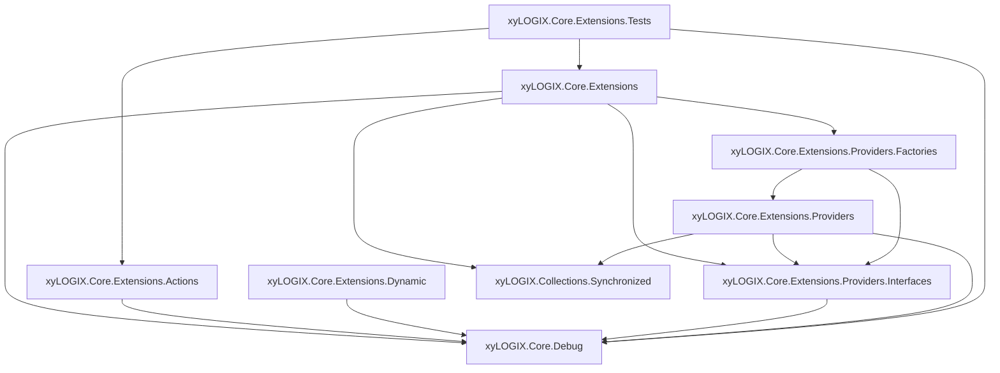
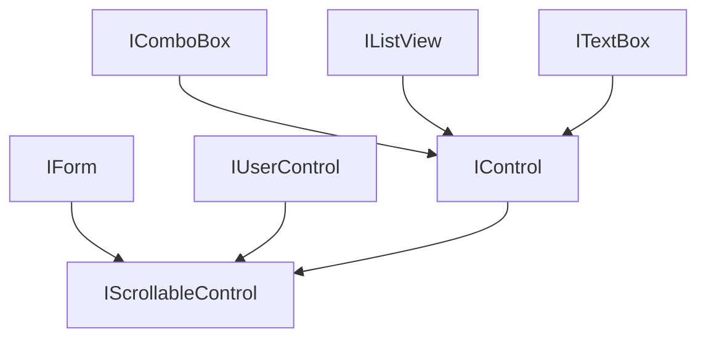

# xyLOGIX.Core.Extensions `module`

**Target stack:**
- C# 7.3
- .NET Framework 4.8
- Visual Studio 2019 / 2022

**Key NuGet dependencies:**
- PostSharp 2024.x
- log4net 3.0.x
- AlphaFS 2.2.x
- Newtonsoft.Json 13.0.x

---

## Table of Contents

1. [Solution Overview](#1-solution-overview)
2. [Solution Architecture and Dependency Graph](#2-solution-architecture-and-dependency-graph)
3. [Project-by-Project Reference](#3-project-by-project-reference)
   - 3.1 [xyLOGIX.Core.Extensions](#31-xylogixcoreextensions)
   - 3.2 [xyLOGIX.Core.Extensions.Actions](#32-xylogixcoreextensionsactions)
   - 3.3 [xyLOGIX.Core.Extensions.Dynamic](#33-xylogixcoreextensionsdynamic)
   - 3.4 [xyLOGIX.Core.Extensions.Providers.Interfaces](#34-xylogixcoreextensionsprovidersinterfaces)
   - 3.5 [xyLOGIX.Core.Extensions.Providers](#35-xylogixcoreextensionsproviders)
   - 3.6 [xyLOGIX.Core.Extensions.Providers.Factories](#36-xylogixcoreextensionsprovidersfactories)
   - 3.7 [xyLOGIX.Core.Extensions.Tests](#37-xylogixcoreextensionstests)
4. [Detailed API Reference](#4-detailed-api-reference)
   - 4.1 [String Utilities](#41-string-utilities)
   - 4.2 [Enumerable and Collection Utilities](#42-enumerable-and-collection-utilities)
   - 4.3 [Numeric Utilities](#43-numeric-utilities)
   - 4.4 [DateTime Utilities](#44-datetime-utilities)
   - 4.5 [Guid Utilities](#45-guid-utilities)
   - 4.6 [Enum Utilities](#46-enum-utilities)
   - 4.7 [Byte Array Utilities](#47-byte-array-utilities)
   - 4.8 [Dictionary Utilities](#48-dictionary-utilities)
   - 4.9 [Type Reflection Utilities](#49-type-reflection-utilities)
   - 4.10 [Pathname Utilities](#410-pathname-utilities)
   - 4.11 [Markdown Utilities](#411-markdown-utilities)
   - 4.12 [Text Transformation Utilities](#412-text-transformation-utilities)
   - 4.13 [WinForms: Control Utilities](#413-winforms-control-utilities)
   - 4.14 [WinForms: Form Utilities](#414-winforms-form-utilities)
   - 4.15 [WinForms: TextBox Utilities](#415-winforms-textbox-utilities)
   - 4.16 [WinForms: ComboBox Utilities](#416-winforms-combobox-utilities)
   - 4.17 [WinForms: CheckedListBox Utilities](#417-winforms-checkedlistbox-utilities)
   - 4.18 [WinForms: ToolStripMenuItem Utilities](#418-winforms-toolstripmenuitem-utilities)
   - 4.19 [WinForms: BindingManagerBase Utilities](#419-winforms-bindingmanagerbase-utilities)
   - 4.20 [WinForms: Component Utilities](#420-winforms-component-utilities)
   - 4.21 [WinForms Interfaces — IForm, IControl, IUserControl, etc.](#421-winforms-interfaces--iform-icontrol-iusercontrol-etc)
   - 4.22 [The Prefer Class (Actions)](#422-the-prefer-class-actions)
   - 4.23 [The Round Class (Actions)](#423-the-round-class-actions)
   - 4.24 [The Calculate Class](#424-the-calculate-class)
   - 4.25 [The Transform Class](#425-the-transform-class)
   - 4.26 [DynamicPrefer (Dynamic)](#426-dynamicprefer-dynamic)
   - 4.27 [ControlFormAssociationProvider (Providers)](#427-controlformassociationprovider-providers)
5. [Cross-Cutting Concerns and Design Decisions](#5-cross-cutting-concerns-and-design-decisions)
   - 5.1 [PostSharp Logging Integration](#51-postsharp-logging-integration)
   - 5.2 [Defensive Programming and the `result` Variable Pattern](#52-defensive-programming-and-the-result-variable-pattern)
   - 5.3 [AlphaFS vs. System.IO](#53-alphafs-vs-systemio)
   - 5.4 [Thread Safety](#54-thread-safety)
6. [How to Add a Reference to This Library](#6-how-to-add-a-reference-to-this-library)
7. [Running the Tests](#7-running-the-tests)
8. [Code Documentation](#8-code-documentation)

---

## 1. Solution Overview

The **xyLOGIX.Core.Extensions** solution is a cohesive group of .NET Framework 4.8 class libraries whose collective purpose is to augment the base class library and Windows Forms with a rich set of tightly-focused, defensive extension methods, action classes, and provider infrastructure.  Every public method in this solution follows the same hardened coding idioms:

- A `result` variable is declared and initialized to a safe default at the top of every non-`void` method.
- The entire method body is wrapped in a single `try`/`catch(Exception)` block.
- Exceptions are logged via `xyLOGIX.Core.Debug.DebugUtils.LogException` and the safe default is returned — callers never receive an unhandled exception.
- Input parameters are validated eagerly and individually, using separate `if` guards that `return result;` immediately.
- PostSharp aspects (`[Log]`, `[ExplicitlySynchronized]`, `[NotLogged]`) are applied consistently to control logging verbosity and threading semantics.

The solution is structured following the xyLOGIX module convention: the base class library (`xyLOGIX.Core.Extensions`) owns concrete extension classes; `.Actions` contains static action classes; `.Dynamic` handles `dynamic`-typed scenarios; `.Providers`, `.Providers.Interfaces`, and `.Providers.Factories` implement the provider pattern for the control-to-form association service; and `.Tests` houses the NUnit 4.x test suite.

---

## 2. Solution Architecture and Dependency Graph

The diagram below shows every project in the solution and the direction of its compile-time references.  An arrow from **A ? B** means **A** has a project or assembly reference to **B**.



**Key observations:**

| Rule | Detail |
|---|---|
| No circular references | All arrows are strictly acyclic. |
| `xyLOGIX.Core.Debug` is a leaf | Every project references it; it references nothing in this solution. |
| `xyLOGIX.Core.Extensions` is the hub | All WinForms extension classes live here; it pulls in the `Providers.Factories` project to resolve the singleton provider. |
| `Actions` and `Dynamic` are independent | They do not reference each other, or the main `Extensions` project; they only share the `Debug` library. |
| Provider trio follows Interface ? Impl ? Factory order | This keeps the dependency arrow direction clean and avoids cycles. |

---

## 3. Project-by-Project Reference

### 3.1 `xyLOGIX.Core.Extensions`

**Assembly:** `xyLOGIX.Core.Extensions.dll`  
**Namespace:** `xyLOGIX.Core.Extensions`

This is the primary class library of the solution.  It contains the largest collection of extension classes and support types, including:

- All `*Extensions` static classes — catalogued in full in the table below.
- The `Calculate` and `Transform` static action classes.
- The `LanguageArticleType` enum and its associated `LanguageArticleTypeValidator`.
- The `ReplaceAnyOfOption` enum.
- The WinForms interface definitions: `IForm`, `IControl`, `IUserControl`, `IScrollableControl`, `IComboBox`, `IListView`, `ITextBox`.
- The `BoundComboBox` and `EnumBoundComboBoxItem` helper types.

#### `*Extensions` Class Catalogue

Every class in this table is `public static` and lives in the `xyLOGIX.Core.Extensions` namespace.

| Class | Extended type(s) | 50,000-foot synopsis |
|---|---|---|
| `BindingManagerBaseExtensions` | `BindingManagerBase` | Suspends and resumes two-way WinForms data binding on a `BindingManagerBase` instance by toggling each binding's `DataSourceUpdateMode` between `Never` and its original value — useful when you need to update the data source programmatically without triggering cascading change notifications. |
| `ByteArrayExtensions` | `byte[]` | Provides null-safe helpers for byte arrays, including a safe `Length` accessor that returns `0` for `null` arrays, a hex-string formatter that produces space-separated uppercase pairs (e.g., `"4A 2F 00"`), and a Base-64 encoder. |
| `CharExtensions` | `char` | Extends `char` with semantic classification predicates such as `IsVowel` and `IsConsonant`, which are used internally by string-manipulation methods like `GetLanguageArticle`. |
| `CheckedListBoxExtensions` | `CheckedListBox` | Adds bulk check/uncheck operations (`CheckAll`, `UncheckAll`) and a typed `GetCheckedItems<T>` query to `CheckedListBox`, eliminating the need for manual iteration over `CheckedItems` in calling code. |
| `CollectionExtensions` | `ICollection<T>` | Adds `AddMultiple<T>`, a `params`-based variadic insert that populates an `ICollection<T>` in a single call without allocating a temporary list — a lighter alternative to `AddRange`. |
| `ComboBoxExtensions` | `ComboBox` | Provides enum-binding helpers (`BindToEnum<T>`, `GetSelectedEnumValue<T>`, `SelectEnumValue<T>`) that populate a `ComboBox` from any `enum` type and leverage `[Description]` attributes for human-readable display text. |
| `ComponentExtensions` | `IComponent` | Exposes `IsBeingDisposed`, a lightweight heuristic that returns `true` when a component's `Site` property is `null`, signalling that the component is in mid-disposal and should not be interacted with. |
| `ControlExtensions` | `Control` | The central WinForms threading and lifetime helper: provides the safe cross-thread `InvokeIfRequired` / `InvokeIfRequired<T>` overloads, and the `AssociateWithParentForm` / `GetParentForm` pair that maintains a live `Control`?`Form` registry via the provider infrastructure. |
| `DateTimeExtensions` | `DateTime` | Formats `DateTime` values as RFC 3339 / ISO 8601 strings (auto-converting to UTC) and as human-readable sentence fragments such as `"on 10/16/2024 at 4:59:02 PM"` for use in log messages and UI labels. |
| `DateTimeOffsetExtensions` | `DateTimeOffset` | Mirrors `DateTimeExtensions` for `DateTimeOffset` values and additionally exposes a temporal ordering helper (`IsMoreRecentThan`) for comparing two `DateTimeOffset` timestamps. |
| `DictionaryExtensions` | `IDictionary<TKey,TValue>` / `ConcurrentDictionary<TKey,TValue>` | Adds `GetValueOrDefault` (safe key lookup with a caller-supplied fallback) and `AddOrUpdate` (insert-or-replace in a single call) to any `IDictionary<TKey,TValue>`, plus overloads for `ConcurrentDictionary`. |
| `EnumExtensions` | `Enum` | Resolves the `[Description]` attribute value for any enum member via `AsString<T>` and provides `IsOutOfRange<T>` / `IsInRange<T>` predicates that call `Enum.IsDefined` to guard against out-of-band integer casts. |
| `EnumerableExtensions` | `IEnumerable<T>` | A broad LINQ companion providing `IsNullOrEmpty<T>`, `ForEach<T>` (with null-element skipping), `AnyEqual<T>`, `AnyEqualAnyOf<T>`, and `ToAdvisableCollection<T>` for materializing sequences into PostSharp-observable collections. |
| `FormExtensions` | `IForm` / `Form` | Geometry and presentation helpers for WinForms windows: arithmetic center-to-parent and center-to-screen positioning, opacity clamping, and async `FadeIn` / `FadeOut` effects using `Task`-based opacity stepping. |
| `GuidExtensions` | `Guid` | Provides ergonomic `Guid` formatters (`AsDigitsWithHyphens`, `AsDigitsWithHyphensAndBraces`) and an `IsZero` predicate that returns `true` for `Guid.Empty`, preventing the Zero GUID from being treated as a valid identifier. |
| `IntExtensions` | `int` | Adds semantic sign-check predicates (`IsPositive`, `IsNegative`, `IsZero`) and a range predicate (`IsBetween`) to `int`, making guard clauses on integer values read as plain English. |
| `ListExtensions` | `IList<T>` / `IList` | Extends both generic and non-generic list interfaces with `ContainsAny<T>`, `IndexOfFirst<T>`, thread-safe snapshot helpers, and bulk-string-join utilities used by code-generation pipelines. |
| `LongExtensions` | `long` | Mirrors `IntExtensions` for the `long` (`Int64`) type, adding `IsPositive`, `IsNegative`, and `IsZero` predicates so that `long` fields used as counts or identifiers can be guarded with the same idiom. |
| `MarkdownExtensions` | `string` / `XNode` | Wraps a string in the minimum number of backticks needed to produce a valid Markdown inline-code span (including the edge case where the content itself contains backticks), and preserves XML-node leading whitespace when converting documentation nodes to Markdown. |
| `NullableDecimalExtensions` | `decimal?` | Provides null-safe sign-check predicates (`IsNegative`, `IsPositive`, `IsZero`, `HasPositiveValue`) for `decimal?`, returning `false` rather than throwing when the nullable has no value. |
| `NullableDoubleExtensions` | `double?` | The `double?` counterpart of `NullableDecimalExtensions` — same null-safe sign predicates applied to nullable floating-point values. |
| `NullableIntExtensions` | `int?` | The `int?` counterpart of `NullableDecimalExtensions` — null-safe `IsNegative`, `IsPositive`, `IsZero`, and `HasPositiveValue` for nullable integers. |
| `NullableLongExtensions` | `long?` | The `long?` counterpart of `NullableDecimalExtensions` — null-safe sign predicates for nullable 64-bit integers. |
| `NumberExtensions` | `double` / `decimal` | Provides cross-numeric-type helpers including `AsDecimal` (converts `double` to `decimal` safely), and `IsZero`, `IsPositive`, `IsNegative`, and `IsNaN` predicates for both `double` and `decimal`. |
| `ObjectExtensions` | `object` | Extends `object` with a `ToFormattedString` helper that leverages PostSharp's `IFormattable` infrastructure to produce a structured log-friendly representation of any object without risking a `NullReferenceException`. |
| `PathnameExtensions` | `string` (path-valued) | Treats an extended `string` as a file-system path and provides AlphaFS-backed helpers including a null-safe file-existence check and an idempotent trailing-separator appender, both correctly handling long (> 260-character) and UNC paths. |
| `SetExtensions` | `ISet<T>` | Adds a bulk `AddRange<T>` overload to any `ISet<T>`, silently skipping `null` elements and absorbing duplicates in accordance with set semantics. |
| `StringArrayExtensions` | `string[]` | Extends `string[]` with filtering, joining, and searching helpers — including a `ContainsIgnoreCase` predicate and an `ExceptNullOrWhiteSpace` filter — that would otherwise require verbose inline LINQ in calling code. |
| `StringExtensions` | `string` | The largest class in the solution: covers Title Case and sentence-case formatting (with acronym preservation and small-word rules), GUID detection, pluralization / singularization via the EF design-time `PluralizationService`, `ContainsAnyOf`, `ReplaceAnyOf`, `Repeat`, `RemoveAll`, language-article resolution, and numerous other string-manipulation utilities. |
| `TextBoxExtensions` | `TextBox` | Exposes `SetCueBannerText`, which sends the Win32 `EM_SETCUEBANNER` message (via P/Invoke `SendMessage`) to display grayed-out watermark text in an empty, unfocused `TextBox`, with a live-handle guard via `IsWindow`. |
| `ToolStripMenuItemExtensions` | `ToolStripMenuItem` | Adds `SetShortcutKeyDisplayString`, which writes a custom string into the shortcut-key column of a menu item — useful for displaying non-standard key-chord descriptions (e.g., mouse gestures) in a `MenuStrip`. |
| `TypeExtensions` | `Type` | Reflection helpers for working with generic and array `Type` objects: `GetActualType` unwraps the element type of `IList<T>` or array types (with an `AdvisableDictionary` result cache), `HasInterface` checks for interface implementation, and `IsNullable` tests for `Nullable<T>`. |

**Notable external dependencies:**
- `AlphaFS 2.2.x` — used in place of `System.IO` for file and path operations throughout `PathnameExtensions` and `StringExtensions`.
- `System.Data.Entity.Design` — used in `StringExtensions` for the `PluralizationService`.

---

### 3.2 `xyLOGIX.Core.Extensions.Actions`

**Assembly:** `xyLOGIX.Core.Extensions.Actions.dll`  
**Namespace:** `xyLOGIX.Core.Extensions.Actions`

Houses two static action classes that follow the xyLOGIX *verb-noun* naming convention:

| Class | Purpose |
|---|---|
| `Prefer` | Merges a nullable value with a preferred (default) value for every C++ primitive type, `string`, and `object`. |
| `Round` | Rounds `decimal` quantities to a desired precision (e.g., nearest cent using banker's rounding). |

This project intentionally has no dependency on the main `Extensions` project; it is a pure utility library.

---

### 3.3 `xyLOGIX.Core.Extensions.Dynamic`

**Assembly:** `xyLOGIX.Core.Extensions.Dynamic.dll`  
**Namespace:** `xyLOGIX.Core.Extensions.Dynamic`

Contains the single class `DynamicPrefer`, which provides the same *prefer-over-null* semantics as `Prefer` but operates on `dynamic`-typed values.  It is kept in its own assembly because the C# `dynamic` keyword introduces a dependency on the DLR; isolating it prevents that dependency from infecting the rest of the solution.

---

### 3.4 `xyLOGIX.Core.Extensions.Providers.Interfaces`

**Assembly:** `xyLOGIX.Core.Extensions.Providers.Interfaces.dll`  
**Namespace:** `xyLOGIX.Core.Extensions.Providers.Interfaces`

Declares the `IControlFormAssociationProvider` interface.  Following the xyLOGIX convention, this `.Interfaces` project is always the lowest-level project in the provider trio; nothing in the solution depends on a concrete type from this project.

---

### 3.5 `xyLOGIX.Core.Extensions.Providers`

**Assembly:** `xyLOGIX.Core.Extensions.Providers.dll`  
**Namespace:** `xyLOGIX.Core.Extensions.Providers`

Contains `ControlFormAssociationProvider`, the concrete singleton implementation of `IControlFormAssociationProvider`.  It maintains an `AdvisableDictionary<Control, Form>` that maps each registered `Control` to the `Form` that contains it, and automatically cleans up entries when either the control or its parent form is destroyed.

The constructor is `protected` and the class exposes a `public static IControlFormAssociationProvider Instance` property; callers are expected to obtain the singleton via the factory in the `.Factories` project rather than accessing `Instance` directly.

---

### 3.6 `xyLOGIX.Core.Extensions.Providers.Factories`

**Assembly:** `xyLOGIX.Core.Extensions.Providers.Factories.dll`  
**Namespace:** `xyLOGIX.Core.Extensions.Providers.Factories`

Exposes `GetControlFormAssociationProvider.SoleInstance()`, which is the canonical way to obtain the singleton `IControlFormAssociationProvider`.  `ControlExtensions` (in the main library) calls this factory internally so that consumers of `ControlExtensions` need not know how the provider is constructed.

---

### 3.7 `xyLOGIX.Core.Extensions.Tests`

**Assembly:** `xyLOGIX.Core.Extensions.Tests.dll`  
**Namespace:** `xyLOGIX.Core.Extensions.Tests`

NUnit 4.x test project.  Currently covers:

| Test Fixture | Class Under Test |
|---|---|
| `PreferTests` | `Prefer` (in `Actions`) |
| `NumberExtensionsTests` | `NumberExtensions` |

All test fixtures derive from `LoggingTestBase` (from `xyLOGIX.Tests.Logging`) so that PostSharp and log4net logging is active during test runs.  Each fixture is annotated `[TestFixture]` and `[ExplicitlySynchronized]`.

---

## 4. Detailed API Reference

### 4.1 String Utilities

**Class:** `StringExtensions` — `xyLOGIX.Core.Extensions`

`StringExtensions` is the largest class in the solution.  It provides operations in several categories.

#### Case and Title Formatting

| Method | Signature | Description |
|---|---|---|
| `ToTitleCase` | `string ToTitleCase(this string value)` | Converts a string to Title Case using the current culture's `TextInfo`, while intelligently preserving known acronyms (e.g., `"AP"`, `"LSAT"`) in all-caps and handling small words (`"of"`, `"the"`, `"and"`, etc.) that should not be capitalized unless they are the first word. |
| `ToSentenceCase` | `string ToSentenceCase(this string value)` | Capitalizes only the first character of a string. |

#### Searching and Matching

| Method | Signature | Description |
|---|---|---|
| `ContainsAnyOf` | `bool ContainsAnyOf(this string value, params string[] candidates)` | Returns `true` if the string contains any one of the provided candidate substrings. |
| `IsGuid` | `bool IsGuid(this string value)` | Returns `true` if the string is parseable as a `Guid` with no surrounding braces (lowercase hex digits with hyphens). |
| `ContainsGuid` | `bool ContainsGuid(this string value)` | Returns `true` if the string contains an embedded GUID pattern anywhere within it. |

#### Manipulation

| Method | Signature | Description |
|---|---|---|
| `ReplaceAnyOf` | `string ReplaceAnyOf(this string value, string[] targets, string replacement, ReplaceAnyOfOption option)` | Replaces all occurrences of any of the `targets` substrings with `replacement`. The `ReplaceAnyOfOption` enum controls whether the search is case-sensitive. |
| `Repeat` | `string Repeat(this string value, int count)` | Returns a new string formed by repeating `value` exactly `count` times. Returns `string.Empty` if `count` is zero or negative. |
| `RemoveAll` | `string RemoveAll(this string value, params char[] chars)` | Removes every character in `chars` from the string. |
| `RemoveLeading` | `string RemoveLeading(this string value, string prefix)` | If the string starts with `prefix`, returns the string with that prefix removed; otherwise returns the string unchanged. |

#### Pluralization

| Method | Signature | Description |
|---|---|---|
| `Pluralize` | `string Pluralize(this string word)` | Uses `System.Data.Entity.Design.PluralizationServices.PluralizationService` to return the plural form of `word` in English. Returns `string.Empty` on failure. |
| `Singularize` | `string Singularize(this string word)` | Returns the singular form of `word` using the same pluralization service. |

#### Validation Helpers

| Method | Signature | Description |
|---|---|---|
| `IsNullOrEmpty` | `bool IsNullOrEmpty(this string value)` | Extension-method wrapper for `string.IsNullOrEmpty`. |
| `IsNullOrWhiteSpace` | `bool IsNullOrWhiteSpace(this string value)` | Extension-method wrapper for `string.IsNullOrWhiteSpace`. |

#### Language Article

| Method | Signature | Description |
|---|---|---|
| `GetLanguageArticle` | `string GetLanguageArticle(this string noun)` | Returns `"a"` or `"an"` as appropriate for the given English noun, based on whether it starts with a vowel sound. |

---

### 4.2 Enumerable and Collection Utilities

**Classes:** `EnumerableExtensions`, `CollectionExtensions`, `ListExtensions`, `SetExtensions`

#### `EnumerableExtensions`

| Method | Signature | Description |
|---|---|---|
| `AnyEqual<T>` | `bool AnyEqual<T>(this IEnumerable<T> collection, T value)` | Returns `true` if at least one element of `collection` equals `value`. |
| `AnyEqualAnyOf<T>` | `bool AnyEqualAnyOf<T>(this IEnumerable<T> collection, params T[] values)` | Returns `true` if any element of `collection` is equal to any element of `values`. |
| `IsNullOrEmpty<T>` | `bool IsNullOrEmpty<T>(this IEnumerable<T> source)` | Returns `true` if `source` is `null` or contains no elements. |
| `ForEach<T>` | `void ForEach<T>(this IEnumerable<T> source, Action<T> action)` | Iterates `source` and calls `action` for each element.  Null elements are skipped. |
| `ToAdvisableCollection<T>` | `AdvisableCollection<T> ToAdvisableCollection<T>(this IEnumerable<T> source)` | Materializes the sequence into a PostSharp `AdvisableCollection<T>`, which supports change notifications. |

#### `CollectionExtensions`

| Method | Signature | Description |
|---|---|---|
| `AddMultiple<T>` | `void AddMultiple<T>(this ICollection<T> collection, params T[] items)` | Adds multiple items to `collection` without allocating a temporary list for `AddRange`. Null items are silently skipped. |

#### `ListExtensions`

| Method | Signature | Description |
|---|---|---|
| `ContainsAny<T>` | `bool ContainsAny<T>(this IList<T> list, params T[] values)` | Returns `true` if `list` contains at least one element from `values`. |
| `IndexOfFirst<T>` | `int IndexOfFirst<T>(this IList<T> list, Predicate<T> match)` | Returns the zero-based index of the first element that satisfies `match`, or `-1` if none is found. |

#### `SetExtensions`

| Method | Signature | Description |
|---|---|---|
| `AddRange<T>` | `void AddRange<T>(this ISet<T> set, IEnumerable<T> items)` | Adds all elements of `items` to `set`, silently skipping null items. |

---

### 4.3 Numeric Utilities

**Classes:** `NumberExtensions`, `IntExtensions`, `LongExtensions`, `NullableIntExtensions`, `NullableDoubleExtensions`, `NullableDecimalExtensions`, `NullableLongExtensions`

#### `NumberExtensions` (operating on `double` and `decimal`)

| Method | Signature | Description |
|---|---|---|
| `AsDecimal` | `decimal AsDecimal(this double value)` | Converts `double` to `decimal` using `Convert.ToDecimal`. Returns `decimal.Zero` on failure or when `value` is `0D`. |
| `IsZero` | `bool IsZero(this decimal value)` | Returns `true` if `value` equals `decimal.Zero`. |
| `IsZero` | `bool IsZero(this double value)` | Returns `true` if `value` equals `0D`. |
| `IsPositive` | `bool IsPositive(this decimal value)` | Returns `true` if `value > decimal.Zero`. |
| `IsNegative` | `bool IsNegative(this decimal value)` | Returns `true` if `value < decimal.Zero`. |
| `IsNaN` | `bool IsNaN(this double value)` | Returns `true` if `double.IsNaN(value)`. |

#### `IntExtensions`

| Method | Signature | Description |
|---|---|---|
| `IsPositive` | `bool IsPositive(this int value)` | Returns `true` if `value > 0`. |
| `IsNegative` | `bool IsNegative(this int value)` | Returns `true` if `value < 0`. |
| `IsZero` | `bool IsZero(this int value)` | Returns `true` if `value == 0`. |
| `IsBetween` | `bool IsBetween(this int value, int lowerBound, int upperBound)` | Returns `true` if `lowerBound <= value <= upperBound`. |

#### Nullable numeric types

`NullableIntExtensions`, `NullableDoubleExtensions`, `NullableDecimalExtensions`, and `NullableLongExtensions` each expose analogous `IsZero`, `IsPositive`, `IsNegative`, and `HasPositiveValue` methods that gracefully return `false` when the nullable has no value, rather than throwing.

---

### 4.4 DateTime Utilities

**Classes:** `DateTimeExtensions`, `DateTimeOffsetExtensions`

#### `DateTimeExtensions`

| Method | Signature | Description |
|---|---|---|
| `ToRFC3339` | `string ToRFC3339(this DateTime date)` | Formats a `DateTime` as an RFC 3339 / ISO 8601 string (`yyyy-MM-ddTHH:mm:ss...Z`).  Converts to UTC automatically if the value's `Kind` is not already `Utc`. Returns `string.Empty` on failure. |
| `ToSentencePart` | `string ToSentencePart(this DateTime dateTime)` | Produces a human-readable phrase such as `"on 10/16/2024 at 4:59:02 PM"` suitable for use in log messages or UI text. |

#### `DateTimeOffsetExtensions`

| Method | Signature | Description |
|---|---|---|
| `ToRFC3339` | `string ToRFC3339(this DateTimeOffset date)` | Same semantics as `DateTimeExtensions.ToRFC3339` but operates on a `DateTimeOffset`. |

---

### 4.5 Guid Utilities

**Class:** `GuidExtensions`

| Method | Signature | Description |
|---|---|---|
| `AsDigitsWithHyphens` | `string AsDigitsWithHyphens(this Guid guid)` | Formats the GUID as lowercase digits with hyphens and no surrounding braces (the `"D"` format specifier). Returns `string.Empty` if the Zero GUID is passed. |
| `AsDigitsWithHyphensAndBraces` | `string AsDigitsWithHyphensAndBraces(this Guid guid)` | Formats the GUID with surrounding braces (the `"B"` format specifier). Returns `string.Empty` for the Zero GUID. |
| `IsZero` | `bool IsZero(this Guid value)` | Returns `true` if `value == Guid.Empty`. |

**Usage example:**

```csharp
var id = Guid.NewGuid();
Console.WriteLine(id.AsDigitsWithHyphens());
// e.g., "b8f967ce-911d-4184-a0ba-b37e443b4541"

if (Guid.Empty.IsZero())
    Console.WriteLine("It is the Zero GUID.");
```

---

### 4.6 Enum Utilities

**Class:** `EnumExtensions`

| Method | Signature | Description |
|---|---|---|
| `AsString<T>` | `string AsString<T>(this T enumerationValue) where T : Enum` | If the enum member is decorated with `[Description("...")]`, returns the description string; otherwise falls back to `value.ToString()`. |
| `IsOutOfRange<T>` | `bool IsOutOfRange<T>(this T enumerationValue) where T : Enum` | Returns `true` if `enumerationValue` is not a defined member of its enum type (i.e., `!Enum.IsDefined`). |
| `IsInRange<T>` | `bool IsInRange<T>(this T enumerationValue) where T : Enum` | The inverse of `IsOutOfRange`. |

**Usage example:**

```csharp
using System.ComponentModel;
using xyLOGIX.Core.Extensions;

public enum Status
{
    [Description("Ready to Go")] Ready,
    [Description("All Done")]   Done,
    Unknown = -1
}

var s = Status.Ready;
Console.WriteLine(s.AsString()); // "Ready to Go"
Console.WriteLine(((Status)999).IsOutOfRange()); // true
```

---

### 4.7 Byte Array Utilities

**Class:** `ByteArrayExtensions`

| Method | Signature | Description |
|---|---|---|
| `GetSafeLength` | `int GetSafeLength(this byte[] bytes)` | Returns `bytes.Length`, or `0` if `bytes` is `null`.  This avoids a `NullReferenceException` in length checks. |
| `ToHexString` | `string ToHexString(this byte[] bytes)` | Converts the byte array to a space-separated string of uppercase hex pairs (e.g., `"4A 2F 00"`). Returns `string.Empty` for `null` or empty arrays. |
| `ToBase64` | `string ToBase64(this byte[] bytes)` | Converts the byte array to a Base-64 encoded string.  Returns `string.Empty` on failure. |

---

### 4.8 Dictionary Utilities

**Class:** `DictionaryExtensions`

| Method | Signature | Description |
|---|---|---|
| `GetValueOrDefault<TKey, TValue>` | `TValue GetValueOrDefault<TKey, TValue>(this IDictionary<TKey, TValue> dictionary, TKey key, TValue defaultValue)` | Returns the value for `key`, or `defaultValue` if `key` is not present or the dictionary is `null`. |
| `AddOrUpdate<TKey, TValue>` | `void AddOrUpdate<TKey, TValue>(this IDictionary<TKey, TValue> dictionary, TKey key, TValue value)` | If `key` is already in the dictionary its value is updated; otherwise the pair is inserted. |

---

### 4.9 Type Reflection Utilities

**Class:** `TypeExtensions`

| Member | Kind | Description |
|---|---|---|
| `CachedActualType` | `AdvisableDictionary<Type, Type>` (static property) | Caches results of `GetActualType` for repeated calls on the same `Type`. |
| `GetActualType` | `Type GetActualType(this Type type)` | Returns the element type of an array, the first generic type argument of a generic collection, or `type` itself if neither applies.  This is useful for data-binding scenarios where you need the "inner" type of an `IList<T>`. |
| `HasInterface` | `bool HasInterface(this Type type, Type interfaceType)` | Returns `true` if `type` implements `interfaceType`. |
| `IsNullable` | `bool IsNullable(this Type type)` | Returns `true` if `type` is `Nullable<T>`. |

---

### 4.10 Pathname Utilities

**Class:** `PathnameExtensions`

All methods in this class treat the extended `string` as a file-system path.  They use **AlphaFS** (`Alphaleonis.Win32.Filesystem`) internally rather than `System.IO`, which means they correctly handle long paths (> 260 characters) and UNC paths on Windows.

| Method | Access | Description |
|---|---|---|
| `FileExists` | `private` | Returns `true` if the path refers to an existing file; gracefully returns `false` instead of throwing when passed blank or null. |
| `AppendDirectorySeparatorChar` | `private` | Ensures the path ends with a `\` separator; idempotent. |

> **Note:** These are `private` helpers consumed by other public methods in the class.  The public API surface for path checking in consuming assemblies is `xyLOGIX.Core.Files.Does` (a separate library); this class provides the lower-level primitives.

---

### 4.11 Markdown Utilities

**Class:** `MarkdownExtensions`

| Method | Signature | Description |
|---|---|---|
| `AsCode` | `string AsCode(this string code)` | Wraps the string in the minimum number of backticks required to avoid collisions with any backtick characters already present in `code`.  If `code` itself starts or ends with a backtick a space is inserted for correctness. Returns `string.Empty` for blank input. |
| `WithPreservedWhitespace` | `string WithPreservedWhitespace(this XNode node)` | Attempts to detect and carry over leading whitespace from an XML node value into the corresponding Markdown output. |

**Usage example:**

```csharp
using xyLOGIX.Core.Extensions;

// Simple case
Console.WriteLine("Hello".AsCode());        // `Hello`

// Code that itself contains a backtick
Console.WriteLine("foo`bar".AsCode());      // `` foo`bar ``
```

---

### 4.12 Text Transformation Utilities

**Class:** `Transform`

| Member | Kind | Description |
|---|---|---|
| `AcronymPattern` | `public const string` | Regex pattern `^[A-Z]+$` — matches strings consisting entirely of uppercase ASCII letters (i.e., acronyms). |
| `InitialCapsWordPattern` | `public const string` | Regex pattern `[A-Z]+(?![a-z])\|[A-Z][a-z]*` — tokenizes a PascalCase or CamelCase string into its constituent words, treating runs of uppercase letters as acronyms. |
| `PascalCasedTextToPhrase` | `string PascalCasedTextToPhrase(string input)` | Converts a PascalCase or CamelCase identifier into a human-readable, space-separated phrase.  Acronyms (all-uppercase runs) are preserved in uppercase; other words are lowercased.  Example: `"MyNASAResearchLab"` ? `"My NASA research lab"`. |

**Usage example:**

```csharp
using xyLOGIX.Core.Extensions;

Console.WriteLine(Transform.PascalCasedTextToPhrase("GetHTTPResponse"));
// Output: "Get HTTP response"

Console.WriteLine(Transform.PascalCasedTextToPhrase("xyLOGIXCoreExtensions"));
// Output: "xy LOGIX core extensions"
```

---

### 4.13 WinForms: Control Utilities

**Class:** `ControlExtensions`

| Method | Signature | Description |
|---|---|---|
| `AssociateWithParentForm` | `void AssociateWithParentForm(this Control control)` | Registers `control` with the singleton `IControlFormAssociationProvider` so that its parent `Form` can later be retrieved by calling `GetParentForm`.  If the control is `null`, being disposed, or already disposed, the method either does nothing or removes it from the registry automatically. |
| `GetParentForm` | `Form GetParentForm(this Control control)` | Returns the parent `Form` that was previously associated with `control` via `AssociateWithParentForm`, or `null` if no association exists. |
| `InvokeIfRequired` | `void InvokeIfRequired(this Control control, Action action)` | Calls `control.Invoke(action)` if `control.InvokeRequired` is `true`; otherwise calls `action` directly on the current thread.  This is the safe cross-thread UI update pattern. |
| `InvokeIfRequired<T>` | `T InvokeIfRequired<T>(this Control control, Func<T> func)` | Same as above but returns a value. |

**The `InvokeIfRequired` pattern — usage example:**

```csharp
using xyLOGIX.Core.Extensions;

// From a background thread:
myLabel.InvokeIfRequired(() => myLabel.Text = "Done!");

// With a return value:
int count = myListBox.InvokeIfRequired(() => myListBox.Items.Count);
```

---

### 4.14 WinForms: Form Utilities

**Class:** `FormExtensions`

| Method | Signature | Description |
|---|---|---|
| `CenterForm(IForm, IForm)` | `void CenterForm(this IForm child, IForm parent)` | Moves `child` so its center aligns with the center of `parent` by setting `StartPosition = Manual` and computing the `Location` arithmetically. Does nothing if either form is `null` or disposed. |
| `CenterForm(IForm, Screen)` | `void CenterForm(this IForm form, Screen screen)` | Centers `form` on the specified `Screen`.  Throws `ArgumentNullException` if `screen` is `null`. |
| `CenterOnScreen` | `void CenterOnScreen(this IForm form)` | Convenience overload that centers `form` on the primary screen. |
| `SetOpacity` | `void SetOpacity(this IForm form, double opacity)` | Sets the `Opacity` property of `form` to `opacity` (clamped to `[0.0, 1.0]`).  Used for fade-in/fade-out effects. |
| `FadeIn` | `Task FadeIn(this IForm form, int durationMs)` | Asynchronously fades `form` from transparent to fully opaque over `durationMs` milliseconds by repeatedly adjusting `Opacity` with small delays. |
| `FadeOut` | `Task FadeOut(this IForm form, int durationMs)` | The inverse of `FadeIn`. |

---

### 4.15 WinForms: TextBox Utilities

**Class:** `TextBoxExtensions`

`TextBoxExtensions` includes P/Invoke signatures for two Win32 functions (`SendMessage` and `IsWindow`) used to set watermark (cue banner) text on text boxes.

| Method | Signature | Description |
|---|---|---|
| `SetCueBannerText` | `void SetCueBannerText(this TextBox textBox, string bannerText)` | Sends the `EM_SETCUEBANNER` (0x1501) message to `textBox.Handle` to display `bannerText` as gray placeholder text when the box is empty and unfocused.  Validates that the window handle is live via `IsWindow` before sending the message. |

**Usage example:**

```csharp
using xyLOGIX.Core.Extensions;

// In Form_Load or the control's handle-created event:
mySearchBox.SetCueBannerText("Type here to search...");
```

---

### 4.16 WinForms: ComboBox Utilities

**Class:** `ComboBoxExtensions`

| Method | Signature | Description |
|---|---|---|
| `BindToEnum<T>` | `void BindToEnum<T>(this ComboBox comboBox) where T : Enum` | Populates `comboBox` with `EnumBoundComboBoxItem<T>` entries — one for each defined value of `T` — and sets `DisplayMember` / `ValueMember` appropriately so that the combo box displays the `[Description]` attribute text (or the member name as a fallback) and returns the strongly typed enum value. |
| `GetSelectedEnumValue<T>` | `T GetSelectedEnumValue<T>(this ComboBox comboBox) where T : Enum` | Returns the currently selected enum value of type `T`, or `default(T)` if nothing is selected. |
| `SelectEnumValue<T>` | `void SelectEnumValue<T>(this ComboBox comboBox, T value) where T : Enum` | Selects the item whose underlying enum value equals `value`, or does nothing if not found. |

---

### 4.17 WinForms: CheckedListBox Utilities

**Class:** `CheckedListBoxExtensions`

| Method | Signature | Description |
|---|---|---|
| `CheckAll` | `void CheckAll(this CheckedListBox listBox)` | Sets the `CheckState` of every item to `Checked`. |
| `UncheckAll` | `void UncheckAll(this CheckedListBox listBox)` | Sets the `CheckState` of every item to `Unchecked`. |
| `GetCheckedItems<T>` | `IList<T> GetCheckedItems<T>(this CheckedListBox listBox)` | Returns a list of the values (cast to `T`) of all currently checked items. Returns an empty list if `listBox` is `null` or has no checked items. |

---

### 4.18 WinForms: ToolStripMenuItem Utilities

**Class:** `ToolStripMenuItemExtensions`

| Method | Signature | Description |
|---|---|---|
| `SetShortcutKeyDisplayString` | `void SetShortcutKeyDisplayString(this ToolStripMenuItem item, string displayString)` | Sets `item.ShortcutKeyDisplayString` to `displayString`, allowing a custom text label for the keyboard shortcut column in the menu. |

---

### 4.19 WinForms: BindingManagerBase Utilities

**Class:** `BindingManagerBaseExtensions`

| Method | Signature | Description |
|---|---|---|
| `GetCurrentPosition` | `int GetCurrentPosition(this BindingManagerBase manager)` | Returns `manager.Position`, or `-1` if `manager` is `null`. |
| `SetCurrentPosition` | `void SetCurrentPosition(this BindingManagerBase manager, int position)` | Sets `manager.Position` to `position` after validating that it is within the bounds of the underlying data source. |

---

### 4.20 WinForms: Component Utilities

**Class:** `ComponentExtensions`

| Method | Signature | Description |
|---|---|---|
| `IsBeingDisposed` | `bool IsBeingDisposed(this IComponent component)` | Returns `true` if the component's `Site` is `null` — a reliable heuristic for whether the component is in the process of being disposed. |

---

### 4.21 WinForms Interfaces — `IForm`, `IControl`, `IUserControl`, etc.

The solution defines a set of thin WinForms interfaces that mirror the public API of the corresponding `System.Windows.Forms` types.  They are used as parameter and return types throughout the extension classes so that callers can substitute mock objects in tests without depending on a live Win32 window handle.



| Interface | Mirrors | Key Additional Members |
|---|---|---|
| `IForm` | `System.Windows.Forms.Form` | `AcceptButton`, `CancelButton`, `ActiveMdiChild`, `DialogResult`, `IsMdiContainer`, `Opacity`, `ShowInTaskbar`, `WindowState`, `Close()`, `Show()`, `ShowDialog()` |
| `IControl` | `System.Windows.Forms.Control` | `Bounds`, `ClientSize`, `Dock`, `Enabled`, `Font`, `Handle`, `Location`, `Name`, `Parent`, `Size`, `Text`, `Visible` |
| `IScrollableControl` | `System.Windows.Forms.ScrollableControl` | `AutoScroll`, `HorizontalScroll`, `VerticalScroll` |
| `IUserControl` | `System.Windows.Forms.UserControl` | Inherits `IScrollableControl`; no additional members |
| `IComboBox` | `System.Windows.Forms.ComboBox` | `DataSource`, `DisplayMember`, `Items`, `SelectedIndex`, `SelectedItem`, `ValueMember` |
| `IListView` | `System.Windows.Forms.ListView` | `Columns`, `Items`, `MultiSelect`, `SelectedItems`, `View` |
| `ITextBox` | `System.Windows.Forms.TextBox` | `Multiline`, `PasswordChar`, `ReadOnly`, `ScrollBars`, `WordWrap` |

---

### 4.22 The `Prefer` Class (Actions)

**Namespace:** `xyLOGIX.Core.Extensions.Actions`

`Prefer` is a static class that solves a common problem in application configuration: you have a *preferred* (default) value from your config file, and an *optional* value that the user may or may not have supplied (e.g., on the command line).  If the user supplied a value, use it; otherwise fall back to the preferred default.

Every method follows the exact same contract:

> If `nullableValue` is non-`null` and has a value **and** that value differs from `preferredValue`, then return `nullableValue.Value`; otherwise return `preferredValue`.

| Method | Nullable input type | Return type |
|---|---|---|
| `BoolOverNull` | `bool?` | `bool` |
| `ByteOverNull` | `byte?` | `byte` |
| `CharOverNull` | `char?` | `char` |
| `DecimalOverNull` | `decimal?` | `decimal` |
| `DoubleOverNull` | `double?` | `double` |
| `FloatOverNull` | `float?` | `float` |
| `IntOverNull` | `int?` | `int` |
| `IntPtrOverNull` | `IntPtr?` | `IntPtr` |
| `LongOverNull` | `long?` | `long` |
| `NonZeroIntPtrOverZero` | `IntPtr` | `IntPtr` |
| `NonZeroUIntPtrOverZero` | `UIntPtr` | `UIntPtr` |
| `ObjectOverNull` | `object` | `object` |
| `SByteOverNull` | `sbyte?` | `sbyte` |
| `ShortOverNull` | `short?` | `short` |
| `StringOverNull` | `string` | `string` |
| `UInt32OverNull` | `uint?` | `uint` |
| `UIntPtrOverNull` | `UIntPtr?` | `UIntPtr` |
| `UShortOverNull` | `ushort?` | `ushort` |

**Usage example:**

```csharp
using xyLOGIX.Core.Extensions.Actions;

// Command-line argument parsing returns null if the user did not supply --port
int? userPort = ParseCommandLinePort(); // may be null

// Application config provides the default
int configPort = Properties.Settings.Default.ListenPort; // e.g., 8080

// Use the user's value if provided, otherwise use the config value
int effectivePort = Prefer.IntOverNull(userPort, configPort);
```

---

### 4.23 The `Round` Class (Actions)

**Namespace:** `xyLOGIX.Core.Extensions.Actions`

| Method | Signature | Description |
|---|---|---|
| `ToNearestCent` | `decimal ToNearestCent(decimal value)` | Rounds `value` to two decimal places using banker's rounding (`MidpointRounding.ToEven`).  Returns `decimal.Zero` if `value` is zero or negative. |

**Usage example:**

```csharp
using xyLOGIX.Core.Extensions.Actions;

decimal price = 9.9950m;
decimal rounded = Round.ToNearestCent(price); // 10.00 (banker's rounding)

decimal discount = 0.0049m;
decimal roundedDiscount = Round.ToNearestCent(discount); // 0.00
```

---

### 4.24 The `Calculate` Class

**Namespace:** `xyLOGIX.Core.Extensions`

| Method | Signature | Description |
|---|---|---|
| `DeltaBetween` | `decimal DeltaBetween(decimal end, decimal start)` | Returns `end - start`.  Returns `decimal.Zero` if `end == start`. Useful for time-series deltas where `end` is the more recent value and `start` is the earlier one. |
| `FractionalChangeBetween` | `decimal FractionalChangeBetween(decimal end, decimal start)` | Returns `(end - start) / start`.  Defined as zero when `start` is zero (avoids division by zero).  Returns the fractional rate of change — multiply by 100 to obtain a percentage. |
| `PercentChangeBetween` | `decimal PercentChangeBetween(decimal end, decimal start)` | Returns `FractionalChangeBetween(end, start) * 100m`, expressed as a percentage. |

**Usage example:**

```csharp
using xyLOGIX.Core.Extensions;

decimal yesterdayClose = 150.00m;
decimal todayClose     = 153.75m;

decimal delta      = Calculate.DeltaBetween(todayClose, yesterdayClose);   // 3.75
decimal pctChange  = Calculate.PercentChangeBetween(todayClose, yesterdayClose); // 2.50
```

---

### 4.25 The `Transform` Class

**Namespace:** `xyLOGIX.Core.Extensions`

| Member | Description |
|---|---|
| `PascalCasedTextToPhrase(string input)` | Splits a PascalCase or CamelCase string into a human-readable space-separated phrase, preserving all-uppercase acronyms. Returns `input` unchanged if it is `null` or empty (idempotent). |

The two public regex patterns (`AcronymPattern`, `InitialCapsWordPattern`) are also exposed as `public const string` fields so consuming code can reuse them without duplicating the regular expression literals.

---

### 4.26 `DynamicPrefer` (Dynamic)

**Namespace:** `xyLOGIX.Core.Extensions.Dynamic`

| Method | Signature | Description |
|---|---|---|
| `DynamicOverNull` | `dynamic DynamicOverNull(dynamic nullableValue, dynamic preferredValue)` | If `nullableValue` is non-`null`, returns `nullableValue`; otherwise returns `preferredValue`.  If both are `null`, returns `preferredValue` (which is also `null`). |

This class exists because the C# 7.3 compiler does not allow `dynamic` as a generic type argument, so the type-safe `Prefer` class cannot cover this case.

---

### 4.27 `ControlFormAssociationProvider` (Providers)

**Namespace:** `xyLOGIX.Core.Extensions.Providers`

The `ControlFormAssociationProvider` maintains a live dictionary that maps each registered `Control` to the `Form` that owns it.  It manages its own lifetime cleanup:

- When a registered `Control` is destroyed (`Disposed` event), the association is removed.
- When the parent `Form` is closed (`FormClosed` event), all associations for controls on that form are removed.

This prevents memory leaks that would otherwise arise from event-handler closures keeping disposed objects alive.

**How the provider is obtained:**

Never instantiate `ControlFormAssociationProvider` directly.  Instead, always use the factory:

```csharp
using xyLOGIX.Core.Extensions.Providers.Factories;
using xyLOGIX.Core.Extensions.Providers.Interfaces;

IControlFormAssociationProvider provider =
    GetControlFormAssociationProvider.SoleInstance();
```

In practice, you will almost never need to call the provider directly — `ControlExtensions.AssociateWithParentForm` and `ControlExtensions.GetParentForm` are the intended entry points.

**Interface summary:**

| Member | Description |
|---|---|
| `void Add(Control control)` | Registers `control` and its parent form. Idempotent; already-registered controls are ignored. |
| `Form GetFormFor(Control control)` | Retrieves the registered parent form, or `null` if none is registered. |
| `bool Remove(Control control)` | Removes the registration for `control`.  Returns `true` on success. |

---

## 5. Cross-Cutting Concerns and Design Decisions

### 5.1 PostSharp Logging Integration

Every project in the solution contains a `GlobalAspects.cs` file that applies assembly-level PostSharp `[Log]` attributes.  This means **every public method call is automatically logged** at entry and exit through PostSharp's weaving — without any manual `DebugUtils.WriteLine` calls needed in the method body for that purpose.

Methods that are explicitly decorated with `[Log(AttributeExclude = true)]` are excluded from this automatic logging.  These are typically:

- Static constructors (to avoid cluttering the log file with `.cctor` entries).
- Very high-frequency, trivially simple methods (e.g., simple property getters and `IsZero` helpers) where log chatter would outweigh benefit.
- `protected` and `public` instance constructors of singletons and base classes.

The `[NotLogged]` parameter attribute suppresses the logging of individual method parameter values — applied to all non-primitive parameters (`string`, `object`, structs, and reference types) to prevent sensitive or verbose data from appearing in log files.

The `[return: NotLogged]` return attribute suppresses logging of return values for methods returning non-primitive types.

### 5.2 Defensive Programming and the `result` Variable Pattern

All non-`void` methods follow this invariant pattern:

```csharp
public ReturnType MethodName(ParamType param)
{
    var result = /* safe default */;

    try
    {
        // Validation gates — each on its own line, each returning result immediately
        if (param == null) return result;
        if (param.Length <= 0) return result;

        // ... main logic ...

        result = computedValue;
    }
    catch (Exception ex)
    {
        // dump all the exception info to the log
        DebugUtils.LogException(ex);

        result = /* safe default, reset */;
    }

    return result;
}
```

Key rules:

- The `result` variable is **always** declared before the `try` block.
- Each validation gate is its own `if` statement — no `||` or `&&` combining multiple checks.
- The `catch` block **always** resets `result` to the same safe default before returning.
- `void` methods still use `try`/`catch` and validate inputs, but have no `result` variable; they use bare `return;` at gate points.
- `try`/`catch` blocks are **never** nested — a nested `try` is always extracted into a helper method.

### 5.3 AlphaFS vs. `System.IO`

Throughout `StringExtensions` and `PathnameExtensions`, `System.IO.File`, `System.IO.Directory`, and `System.IO.Path` are **replaced** with their AlphaFS counterparts:

```csharp
using Directory = Alphaleonis.Win32.Filesystem.Directory;
using File      = Alphaleonis.Win32.Filesystem.File;
using Path      = Alphaleonis.Win32.Filesystem.Path;
```

This is done at the top of the file as `using` aliases so the rest of the file's code reads identically to standard .NET code.  The benefit is transparent support for paths longer than 260 characters (`MAX_PATH`) and correct handling of UNC paths — both common in enterprise Windows environments.

### 5.4 Thread Safety

Classes annotated with `[ExplicitlySynchronized]` (a PostSharp threading model attribute) require that all accesses to their members are synchronized by the caller or by PostSharp's generated thread-safe wrappers.  In this solution:

- `ControlFormAssociationProvider` is `[ExplicitlySynchronized]` because `Control`-to-`Form` associations can be modified from multiple threads (the UI thread creates controls; background threads may query the dictionary).
- `StringExtensions` is also `[ExplicitlySynchronized]` because some of its static fields (e.g., `_textInfoFromCurrentCulture`, `AcronymList`) could be accessed concurrently.

In multithreaded consuming code, **never** call LINQ extension methods on shared `IEnumerable<T>` sequences directly.  Snapshot first:

```csharp
// Safe cross-thread iteration pattern
var snapshot = myCollection.ToArray();
foreach (var item in snapshot)
    Process(item);
```

---

## 6. How to Add a Reference to This Library

This solution uses `packages.config`-based NuGet management and legacy `.csproj` format (non-SDK-style).

**Step 1 — Add the project reference** (if consuming from within the same solution):

In Visual Studio 2022, right-click your project ? **Add** ? **Project Reference** ? select `xyLOGIX.Core.Extensions` (and any other projects from this solution you need).

**Step 2 — Add the `using` directive:**

```csharp
using xyLOGIX.Core.Extensions;          // Core extension methods
using xyLOGIX.Core.Extensions.Actions;  // Prefer, Round
using xyLOGIX.Core.Extensions.Dynamic;  // DynamicPrefer
```

**Step 3 — Verify PostSharp is present:**

This library's `GlobalAspects.cs` applies PostSharp aspects.  If your consuming project does not have PostSharp licensed and installed, you will see build errors from the weaver.  Add the `PostSharp` NuGet package (version matching this solution's `packages.config`) to your consuming project.

**Step 4 — Verify AlphaFS is present (for pathname methods):**

Add `AlphaFS 2.2.x` to your project's `packages.config` if you are calling any method in `PathnameExtensions` or the file-related methods of `StringExtensions`.

---

## 7. Running the Tests

Tests are located in `xyLOGIX.Core.Extensions.Tests`.  The test runner requires an STA thread for any test that shows a WinForms window.

```shell
# From the solution root in a Developer Command Prompt or PowerShell:
dotnet test xyLOGIX.Core.Extensions.Tests\xyLOGIX.Core.Extensions.Tests.csproj

# Or, using vstest.console.exe directly (required for .NET Framework 4.8):
vstest.console.exe xyLOGIX.Core.Extensions.Tests\bin\Debug\xyLOGIX.Core.Extensions.Tests.dll /Framework:net48
```

To collect code coverage:

```shell
dotnet-coverage collect -f cobertura -o coverage.cobertura.xml ^
    dotnet test xyLOGIX.Core.Extensions.Tests\xyLOGIX.Core.Extensions.Tests.csproj
```

### Adding New Tests

1. Create your fixture class in `xyLOGIX.Core.Extensions.Tests`, mirroring the file name of the class under test (e.g., `GuidExtensionsTests.cs`).
2. Decorate the class with `[TestFixture]` and `[ExplicitlySynchronized]`.
3. Derive from `LoggingTestBase`.
4. Follow the Arrange-Act-Assert pattern; one behavior per `[Test]` method; use `[Theory]` / `[TestCase]` for parameterized cases.

---

## 8. Code Documentation

Per-class and per-method XML documentation is compiled into a `README.md` in each project's folder by **Vsxmd** at build time.  Links:

| Project | Documentation |
|---|---|
| `xyLOGIX.Core.Extensions` | [xyLOGIX.Core.Extensions/README.md](xyLOGIX.Core.Extensions/README.md) |
| `xyLOGIX.Core.Extensions.Actions` | [xyLOGIX.Core.Extensions.Actions/README.md](xyLOGIX.Core.Extensions.Actions/README.md) |
| `xyLOGIX.Core.Extensions.Dynamic` | [xyLOGIX.Core.Extensions.Dynamic/README.md](xyLOGIX.Core.Extensions.Dynamic/README.md) |
| `xyLOGIX.Core.Extensions.Providers.Interfaces` | [xyLOGIX.Core.Extensions.Providers.Interfaces/README.md](xyLOGIX.Core.Extensions.Providers.Interfaces/README.md) |
| `xyLOGIX.Core.Extensions.Providers` | [xyLOGIX.Core.Extensions.Providers/README.md](xyLOGIX.Core.Extensions.Providers/README.md) |
| `xyLOGIX.Core.Extensions.Providers.Factories` | [xyLOGIX.Core.Extensions.Providers.Factories/README.md](xyLOGIX.Core.Extensions.Providers.Factories/README.md) |
| `xyLOGIX.Core.Extensions.Tests` | [xyLOGIX.Core.Extensions.Tests/README.md](xyLOGIX.Core.Extensions.Tests/README.md) |

The GitHub repository for this solution is:  
[https://github.com/astrohart/xyLOGIX.Core.Extensions.VS2019](https://github.com/astrohart/xyLOGIX.Core.Extensions.VS2019)
